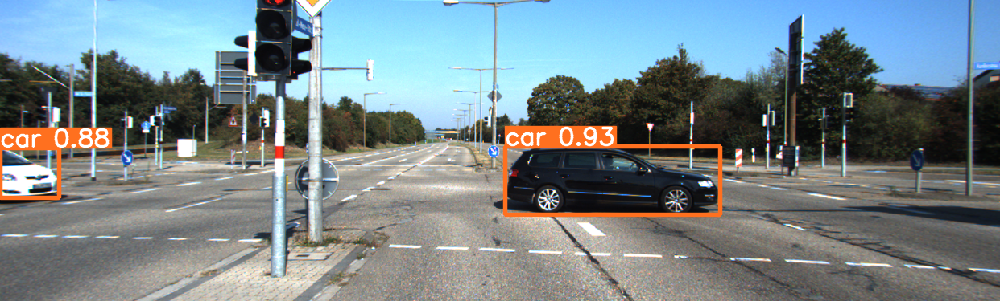

# Computer Vision

This is a repository that includes solutions for task one (Augmented Reality) as well as task two (Object Detection and Distance estimation)

Use docker provided in this repo to match requirements.

## Augmented Reality 
The script works by looping through a series of images. For each image, it detects the Aruco marker and its corners. It then performs a perspective transformation of a predefined image based on the detected corners. The transformed image is then pasted onto the original image.

## Object detection and distance estimation

Goal of this exercise is to estimate the distance form camera to every car on an image. To do so we were using images from KITTI dataset with GT information about distance and calibration matrix of a camera.

### Object detection 

To detect objects in the images we have used [YOLOv9](https://github.com/WongKinYiu/yolov9). Code that we used to inference is based on that one provided by original authors. 

To perform detection we have used yolov9-c-converted.pt model and since we only needed to detect cars the number of classes have beed hardcoded. 
Script takes an directory with images and performs detection returning image with bbox and information about bbox in .txt file.

### Distance estimation

Second part of this task was to estimate the distance.
Script reads three files `Camera Calibration file`, `Labels provided by YOLO`, and `Labels with GT`.

Firstly we had to match detections by calculating IoU which resulted in pair of labels from both sources.
Then using camera matrix and the fact that camera was placed aligned with horizon and at hight 1.65m we were able to measure the distance. 
To do so we decided to use middle bottom point of bbox.

Below are results.

